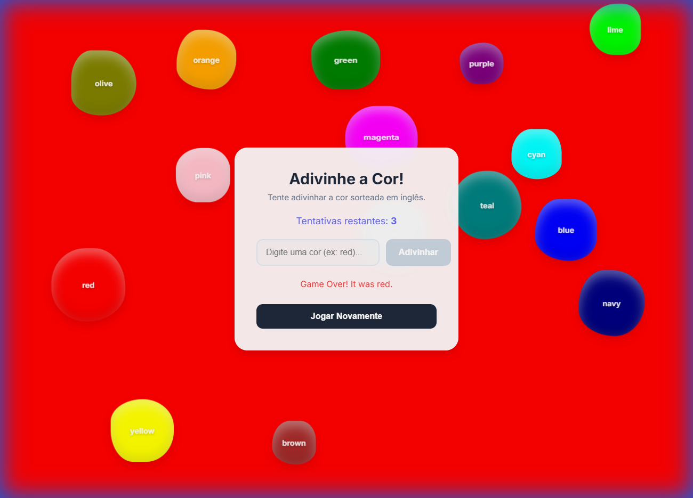

# 🎨 Jogo de Adivinhação de Cores


Um jogo interativo e divertido onde você deve adivinhar a cor sorteada! Desenvolvido com **Vite**, **JavaScript Moderno** e uma física de "gelatina" personalizada.

## ✨ Funcionalidades

- **15 Cores Vibrantes**: O jogo exibe todas as 15 cores possíveis na tela simultaneamente.
- **Física de Gelatina (Jelly Physics)**: As bolas de cor possuem uma física elástica única. Elas "esmagam" e "tremem" ao colidir com as paredes, outras bolas ou com o mouse.
- **Interação com Mouse**: As bolas reagem ao seu cursor! Tente empurrá-las pela tela.
- **Velocidade Controlada**: Um sistema de limite de velocidade garante que o movimento seja sempre suave e relaxante.
- **Revelação de Fundo**: Ao acertar (ou perder), a cor correta preenche todo o fundo da tela para uma revelação visual impactante.
- **Design Responsivo**: Funciona bem em qualquer tamanho de tela, com um visual moderno e "glassmorphism".



## 🚀 Tecnologias

- **HTML5 & CSS3**: Estrutura semântica e estilização moderna.
- **JavaScript (ES6+)**: Lógica do jogo e engine de física personalizada (sem bibliotecas externas de física!).
- **Vite**: Tooling rápido para desenvolvimento e build.

## 🛠️ Como Rodar Localmente

1.  Clone o projeto:
    ```bash
    git clone https://github.com/kevenpll/JogoDeCores.git
    ```
2.  Entre na pasta:
    ```bash
    cd JogoDeCores
    ```
3.  Instale as dependências:
    ```bash
    npm install
    ```
4.  Rode o servidor de desenvolvimento:
    ```bash
    npm run dev
    ```

## ☁️ Deploy na Vercel

Este projeto está configurado para deploy automático na Vercel.

1.  Importe o repositório na Vercel.
2.  O preset "Vite" será detectado automaticamente.
3.  Clique em **Deploy**.

---

Feito com 💜 por Keven.
