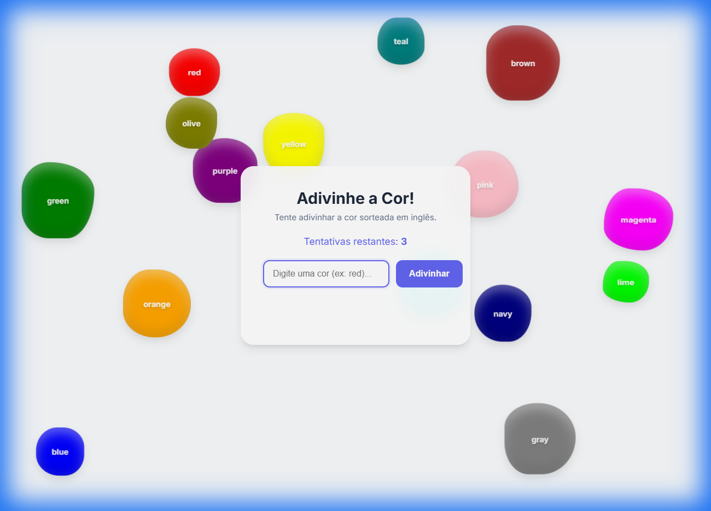

# 🎨 Jogo de Adivinhação de Cores
Link: **[Jogo de cores (Vercel)](https://jogo-de-cores-red.vercel.app/)** | **[GitHub Pages](https://kevenpll.github.io/JogoDeCores/)**

Um jogo interativo e divertido onde você deve adivinhar a cor sorteada! Desenvolvido com **Vite** e **JavaScript**.

## ✨ Funcionalidades

- **15 Cores Vibrantes**: O jogo exibe todas as 15 cores possíveis na tela simultaneamente.
- **Física de "Gelatina"**: As bolas de cor possuem uma física elástica única. Elas "esmagam" e "tremem" ao colidir com as paredes, outras bolas.
- **Interação com Mouse**: As bolas reagem ao seu cursor! Tente empurrá-las pela tela.
- **Revelação de Fundo**: Ao acertar (ou perder), a cor correta preenche todo o fundo da tela para uma revelação visual impactante.
- **Design Responsivo**: Funciona bem em qualquer tamanho de tela, com um visual moderno e "glassmorphism".

## 🚀 Tecnologias

- **HTML5 & CSS3**: Estrutura semântica e estilização moderna.
- **JavaScript (ES6+)**: Lógica do jogo e engine de física personalizada (sem bibliotecas externas de física!).
- **Vite**: Tooling rápido para desenvolvimento e build.
